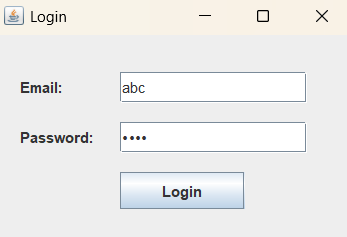
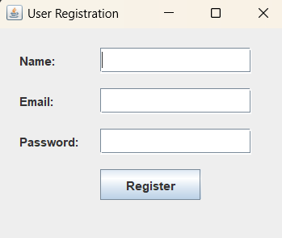
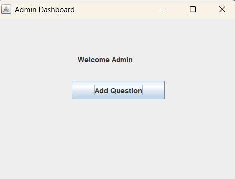
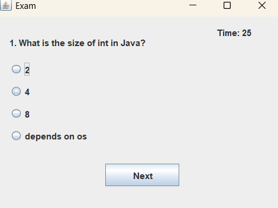
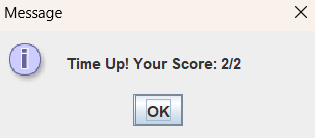

# Online Examination System (Java Swing)

## 📌 Description
A desktop-based online examination system built using Java Swing and MySQL.

## 🚀 Features
- User Registration & Login
- Role-based access (Admin / Student)
- Admin can add questions
- Students can take exams
- Timer-based exam system
- Automatic result calculation
- Results stored in database

## 🛠️ Tech Stack
- Java (Swing)
- MySQL
- JDBC

## ▶️ How to Run
1. Setup MySQL database
2. Run the project in VS Code
3. Start from RegisterUI.java then go to LoginUI.java

## 📊 Future Improvements
- Result history dashboard
- Better UI design
- Web-based version

  ## 📸 Screenshots

### 🔐 Login Screen

### 📝 Registration

### 🛠️ Admin Panel

### 🧪 Exam Screen

### 📊 Result

